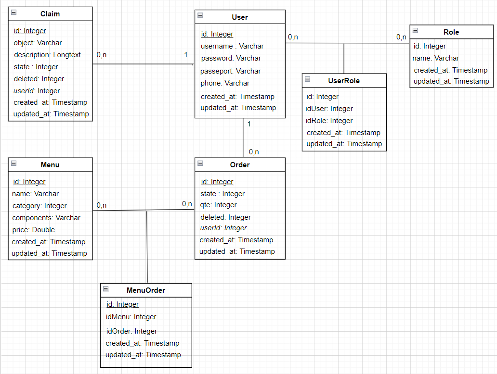

# Room-Service-Management-tool-using-Angular-8.3-And-SpringBoot-2.5.5

## About
This project was made to practice some principals like <b> Guards, services, Lazy Loading Component </b> in Angular, and <b>SpringSecurity, Spring Data JPA, Dependency Injection</b> in SpringBoot.

## Database Design

